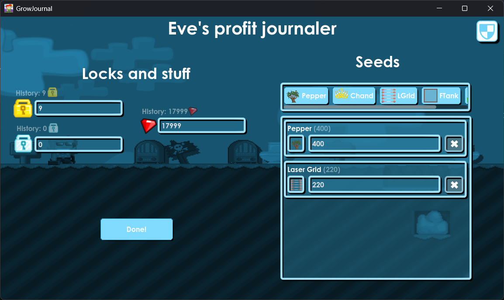

# GrowJournal

Small Growtopia profit journaler I made.
 
GrowJournal works by sending a message to a discord webhook when pressing `Done!`, the URL is configured in the settings window, by pressing the button in the top right corner.

# Showcase

# Installation
You can install the app by downloading the release for your OS in the `releases` tab.

Or you can `git clone https://github.com/EveMeows/GrowJournal` and open the `project.godot` inside your godot installation.

# License
MIT